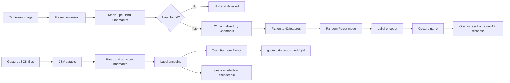

# Gesture Detection System

Real-time hand gesture recognition using MediaPipe Hand Landmarker and a scikit-learn Random Forest classifier.

The project intentionally separates **hand landmark extraction** from **gesture classification**:

1. MediaPipe receives an image and finds the hand's 21 normalized landmarks.
2. The landmarks are converted into 42 numeric features: 21 points x (`x`, `y`).
3. The trained Random Forest predicts a gesture label.

This means the classifier does not consume raw camera pixels. Any application that can provide an image frame to MediaPipe can use the classifier: a webcam, a Streamlit camera, a mobile app, an uploaded image, or a server-side video stream.

## Current Capabilities

- Live webcam recognition through Streamlit and WebRTC.
- MediaPipe Tasks API with asynchronous `LIVE_STREAM` inference.
- Four gesture data files in `data/`: `fist`, `like`, `ok`, and `palm`.
- Serialized Random Forest model and label encoder for inference.
- Landmark visualization utilities for inspecting samples.
- Normalized coordinates that are independent of camera resolution.

## Architecture



### Runtime components

| Component | Responsibility |
| --- | --- |
| `hand_landmarker.task` | MediaPipe's pretrained hand detection and landmark model. |
| `test app.py` | Streamlit UI, WebRTC camera input, landmark extraction, prediction, and drawing. |
| `gesture detection model.pkl` | Fitted `RandomForestClassifier`. |
| `gesture detection encoder.pkl` | Fitted `LabelEncoder` that maps numeric predictions back to names. |
| `model.ipynb` | Dataset preparation, parsing, augmentation, training, and model export. |
| `data/*.json` | Source landmark samples and gesture metadata. |
| `data/combined_gesture_data.csv` | Combined tabular training dataset. |
| `visualize_samples.py` | Plots landmarks and bounding boxes from the JSON samples. |

## Repository Layout

```text
gesture detection model/
├── data/
│   ├── combined_gesture_data.csv
│   ├── fist.json
│   ├── like.json
│   ├── ok.json
│   └── palm.json
├── hand_landmarker.task
├── gesture detection model.pkl
├── gesture detection encoder.pkl
├── model.ipynb
├── test app.py
├── visualize_samples.py
├── requirements.txt
└── README.md
```

## How Inference Works

### Feature contract

Each detected hand produces 21 landmarks. For every landmark, this project keeps only its normalized `x` and `y` values:

```text
[
	[x0, y0], [x1, y1], ..., [x20, y20]
]
```

The array is flattened in landmark order:

```python
features = landmarks.flatten().reshape(1, -1)
# Shape: (1, 42)
prediction = model.predict(features)[0]
gesture_name = encoder.inverse_transform([prediction])[0]
```

The feature order must remain identical during training and inference. Do not pass the raw image, pixel coordinates, bounding box, or a differently ordered landmark array directly to the Random Forest.

### Coordinate system

MediaPipe landmark coordinates are normalized:

- `x = 0` is the left edge of the image and `x = 1` is the right edge.
- `y = 0` is the top edge of the image and `y = 1` is the bottom edge.
- Coordinates are floating-point values, usually in the range `[0, 1]`.

Because the model uses normalized coordinates, a 640x480 frame and a 1920x1080 frame can use the same classifier input format.

## Setup

Use Python 3.13 or a compatible Python version supported by the installed MediaPipe build.

```bash
git clone <repository-url>
cd "gesture detection model"

python3 -m venv .venv
source .venv/bin/activate
python -m pip install --upgrade pip
python -m pip install -r requirements.txt
```

Before starting the app, confirm that the three runtime assets exist and are not empty:

```bash
ls -lh hand_landmarker.task \
	"gesture detection model.pkl" \
	"gesture detection encoder.pkl"
```

`hand_landmarker.task` is a binary MediaPipe asset. A zero-byte file cannot be loaded and causes `RuntimeError: Unable to get file size, errno=0`.

## Run the Included Camera App

```bash
source .venv/bin/activate
streamlit run "test app.py"
```

Open the URL printed by Streamlit, allow camera access, and select **Start** in the WebRTC widget. The browser sends video frames to the Streamlit WebRTC processor.

The live path is:

```text
Browser camera
	-> WebRTC frame
	-> PyAV frame
	-> OpenCV BGR image
	-> RGB MediaPipe image
	-> asynchronous hand landmarks
	-> 42 features
	-> Random Forest prediction
	-> annotated video frame
```

Important implementation details in `test app.py`:

- OpenCV frames arrive as BGR, so they are converted to RGB before MediaPipe.
- `LIVE_STREAM` mode requires `detect_async()` and a monotonically increasing timestamp.
- `num_hands=1` matches the classifier's single-hand training setup.
- The video processor draws landmarks and the predicted gesture back onto the frame.

## Use a Webcam Without Streamlit

The same inference pipeline can be embedded in a desktop application, Flask service, FastAPI service, or another UI. The essential camera loop is:

```python
import cv2

camera = cv2.VideoCapture(0)

while True:
		ok, frame_bgr = camera.read()
		if not ok:
				break

		frame_rgb = cv2.cvtColor(frame_bgr, cv2.COLOR_BGR2RGB)
		# Send frame_rgb to MediaPipe, then classify the returned landmarks.

		cv2.imshow("Gesture detection", frame_bgr)
		if cv2.waitKey(1) & 0xFF == ord("q"):
				break

camera.release()
cv2.destroyAllWindows()
```

For a live camera, configure MediaPipe with `RunningMode.LIVE_STREAM` and call `detect_async()`. Keep the callback result available to the camera loop, as the included Streamlit processor does.

## Classify an Uploaded or Still Image

For one image at a time, use `RunningMode.IMAGE` and the synchronous `detect()` method. This is the simplest integration for an uploaded file, REST endpoint, or batch-processing script.

```python
from pathlib import Path

import cv2
import joblib
import mediapipe as mp
import numpy as np
from mediapipe.tasks import python
from mediapipe.tasks.python import vision

BASE_DIR = Path(__file__).resolve().parent
model = joblib.load(BASE_DIR / "gesture detection model.pkl")
encoder = joblib.load(BASE_DIR / "gesture detection encoder.pkl")

options = vision.HandLandmarkerOptions(
		base_options=python.BaseOptions(
				model_asset_path=str(BASE_DIR / "hand_landmarker.task")
		),
		running_mode=vision.RunningMode.IMAGE,
		num_hands=1,
)

image_bgr = cv2.imread("input.jpg")
if image_bgr is None:
		raise FileNotFoundError("Could not read input.jpg")

image_rgb = cv2.cvtColor(image_bgr, cv2.COLOR_BGR2RGB)
mp_image = mp.Image(image_format=mp.ImageFormat.SRGB, data=image_rgb)

with vision.HandLandmarker.create_from_options(options) as detector:
		result = detector.detect(mp_image)

if not result.hand_landmarks:
		print("No hand detected")
else:
		hand = result.hand_landmarks[0]
		landmarks = np.asarray([[point.x, point.y] for point in hand], dtype=np.float32)
		features = landmarks.reshape(1, 42)
		class_id = model.predict(features)[0]
		print(encoder.inverse_transform([class_id])[0])
```

For a production image endpoint, return a response such as:

```json
{
	"gesture": "like",
	"hand_detected": true,
	"confidence": 0.94
}
```

The current app displays the label but does not expose a calibrated confidence value. If confidence is needed, use the classifier's `predict_proba()` output and document that it is a model score, not a guaranteed probability.

## Streamlit Image Upload Pattern

To add uploaded-image inference to the existing Streamlit app:

```python
from PIL import Image

uploaded_file = st.file_uploader("Upload an image", type=["jpg", "jpeg", "png"])
if uploaded_file is not None:
		uploaded_rgb = np.array(Image.open(uploaded_file).convert("RGB"))
		mp_image = mp.Image(image_format=mp.ImageFormat.SRGB, data=uploaded_rgb)
		# Use a detector configured with RunningMode.IMAGE, then classify its landmarks.
		st.image(uploaded_rgb, caption="Input image")
```

Use a separate `IMAGE` detector for uploaded files. Do not call synchronous `detect()` on the detector configured for `LIVE_STREAM` mode.

## Training Pipeline

The notebook follows this general sequence:

1. Read the gesture JSON files from `data/`.
2. Combine records into `data/combined_gesture_data.csv`.
3. Parse the serialized landmark values into numeric arrays.
4. Keep valid landmark rows and normalize the feature shape.
5. Add small coordinate noise for data augmentation.
6. Encode gesture names with `LabelEncoder`.
7. Flatten each landmark array into a feature vector.
8. Train a balanced `RandomForestClassifier` with 300 trees.
9. Save the classifier and encoder as `.pkl` files.

When adding a new gesture:

1. Add correctly labeled landmark samples to a new JSON file.
2. Rebuild the combined dataset in the notebook.
3. Retrain both the classifier and label encoder.
4. Replace both `.pkl` files together.
5. Test live and still-image inference.

The classifier and encoder are a pair. Replacing only one can produce incorrect labels or decoding errors.

## Data Format

The source JSON records contain fields similar to:

```json
{
	"sample-id": {
		"bboxes": [[0.34, 0.86, 0.26, 0.13]],
		"labels": ["like"],
		"landmarks": [[[0.45, 0.51], [0.49, 0.48]]]
	}
}
```

The runtime classifier uses the landmark coordinates. Bounding boxes and source labels are useful for dataset inspection and visualization, but they are not part of the current 42-feature inference vector.

## Troubleshooting

### `Unable to get file size, errno=0`

Check the task file:

```bash
stat -c '%n %s bytes' hand_landmarker.task
```

If the size is `0`, download the official Hand Landmarker task asset again and restart Streamlit. Also make sure the app is running from the project directory or that the absolute path logic in `test app.py` is preserved.

### `No hand detected`

- Improve lighting and keep the hand inside the camera frame.
- Keep the palm or gesture large enough for the detector.
- Confirm that the browser has camera permission.
- Test a still image first to separate camera/WebRTC problems from MediaPipe problems.

### Predictions are incorrect

- Confirm that the same 21-point landmark order is used for training and inference.
- Confirm that coordinates are normalized and not pixel coordinates.
- Confirm that the model and encoder were exported from the same training run.
- Add more varied samples for the confused gestures.

### Camera does not start

- Use `https://` in deployed environments; browsers commonly block camera access on insecure origins.
- Allow camera permission for the browser tab.
- Check that another application is not holding the camera device.
- For remote deployment, configure WebRTC networking and STUN/TURN as required by the hosting environment.

## Deployment Notes

### Local machine

The included Streamlit app is designed for local development and testing. It uses the browser's camera and runs MediaPipe/classification in the Streamlit Python process.

### Hosted Streamlit

The browser still supplies the camera stream, but deployment must support WebRTC. The `.task` and `.pkl` assets must be included in the deployed project, and their paths should remain relative to the application file or be configured through an environment variable.

### Mobile or web frontend

There are two common designs:

1. **Client-side inference:** run a compatible MediaPipe implementation in the browser or mobile app, then send 42 landmarks to a backend classifier.
2. **Server-side inference:** send camera frames or uploaded images to a Python API, run MediaPipe and the Random Forest on the server, then return the gesture label.

Sending landmarks instead of full images is lighter and reduces image handling, but the client and server must agree on landmark order, coordinate normalization, and hand selection.

## Development Checks

Verify the task model can be opened before debugging the UI:

```bash
./.venv/bin/python -c "from mediapipe.tasks import python; from mediapipe.tasks.python import vision; o=vision.HandLandmarkerOptions(base_options=python.BaseOptions(model_asset_path='hand_landmarker.task'), running_mode=vision.RunningMode.IMAGE, num_hands=1); d=vision.HandLandmarker.create_from_options(o); d.close(); print('HandLandmarker initialized successfully')"
```

Then start the application:

```bash
streamlit run "test app.py"
```

Warnings from TensorFlow Lite about feedback tensors can appear during initialization. They do not prevent Hand Landmarker inference when initialization completes successfully.

## License and Model Assets

This repository contains project code, serialized model artifacts, and a MediaPipe task asset. Check the applicable licenses and redistribution terms for MediaPipe, scikit-learn, and any dataset used before publishing or deploying the project.
